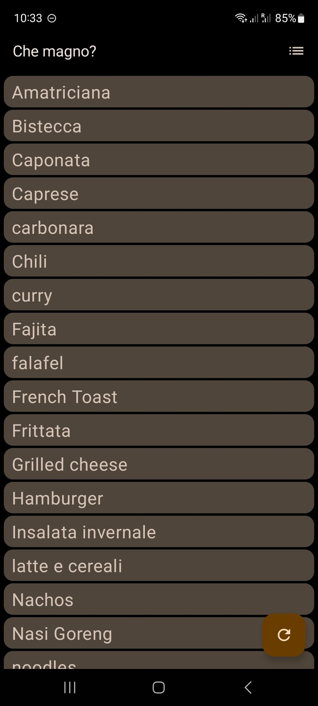
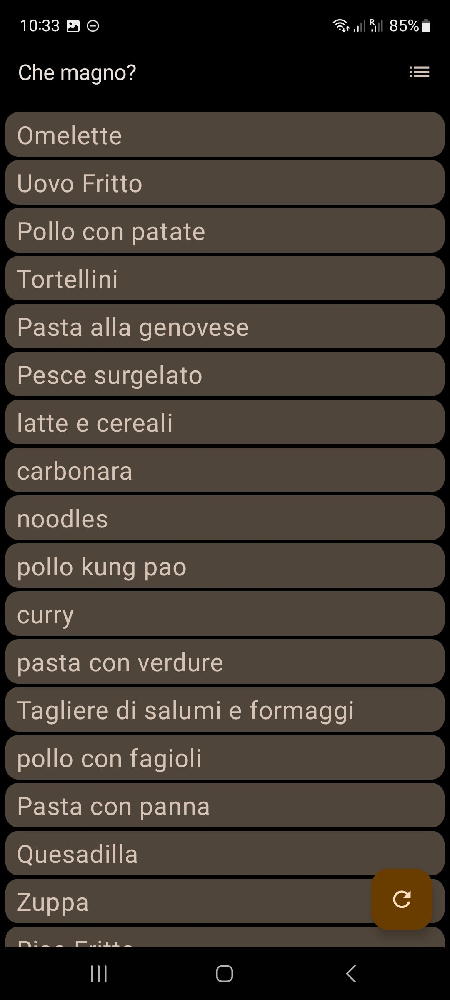
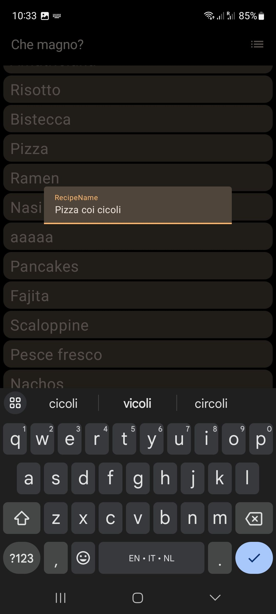

# che-magno
An app to collect recipes and figure out what to eat.

I like to cook, but I always end up eating the same stuff. Having all the recipes I know in a simple list and being able to shuffle them, helps me a lot. This is really a simple list of names, nothing more. I think there are better apps to keep track of recipes, but I personally use a paper notebook.






# Features
- Sort recipes alphabetically
- Shuffle recipes randomly
- Add recipes

# Planned features
- Delete recipes
- Edit recipes
- Add notes to recipes

# File format
Recipes are stored as files in [org format](https://orgmode.org/features.html), this is an example of how a recipe file looks like:
```org
#+title: Amatriciana
#+filetags: :recipe:
* Notes
viva l'italia
```
I went for Org format mainly because I'm very familiar with it and I find it very easy to view and edit without specialized software (easier than markdown). Also, I did the original poc in Emacs and I didn't feel like rewriting all the files.

# Synching recipes
I don't plan to add a sync feature. Feel free to use wathever you want to sync, or backup, the resulting files. I personally use [Syncthing](https://syncthing.net).
